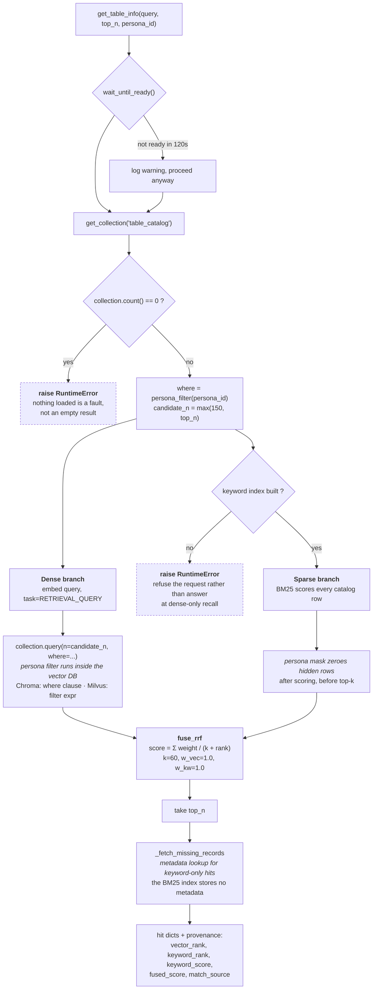
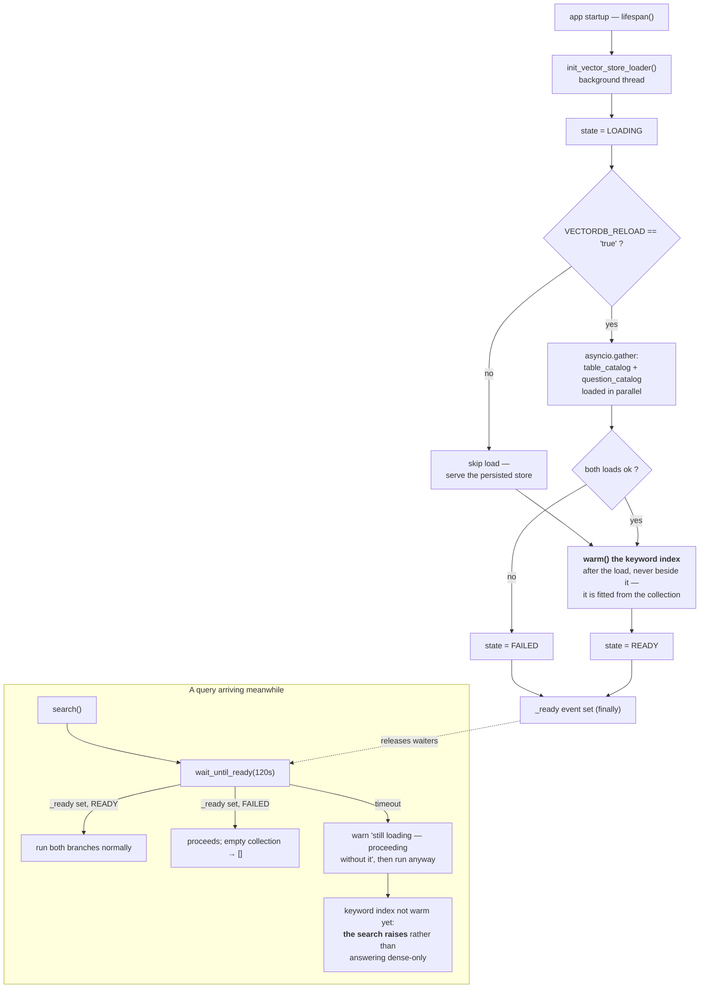

# Table search workflow

---

## 1. Search — `hybrid_search.search()`

Two retrievers run over the same catalog and their **rankings** are fused. One searches by meaning, the other by wording.

**Dense (vector) branch — meaning.** The question is embedded and compared against
the embedded table descriptions. It matches a paraphrase: a question about
*"outstanding balance"* finds a table described as *"utilised amount"*, though
the two have no word in common. It is poor at names, because `om_fm_amount_fact`
means little as text.

**Sparse (BM25) branch — wording.** The question is split into terms and scored on
how many it shares with each table's indexed text. It matches only what is
literally written, which is exactly what you want when the user typed a real
table name, a column, or an internal abbreviation.

Each is blind where the other sees, so the fusion keeps both: the dense branch alone
misses a table the user named outright, the sparse branch alone misses a question
that uses none of the catalog's vocabulary.

## 2. Initialization — and what a query does before it finishes

The loader runs on a **background thread** started in `app/main.py`'s lifespan
hook, so the service accepts traffic immediately. Table search is the only caller
that waits for it.

 

---

## 3. Configuration

| Parameter | Default                                            | Env var | What it does |
|---|----------------------------------------------------|---|---|
| `top_n` | `30`                                               | `SEARCH_TOP_N` | Tables returned when the caller does not say |
| `candidate_n` | `150`                                              | `KEYWORD_CANDIDATE_N` | Depth each branch is read to before fusion |
| `rrf_k` | `60`                                               | `KEYWORD_RRF_K` | RRF damping constant |
| `vector_weight` | `1.0`                                              | `VECTOR_WEIGHT` | Dense branch's weight in the fusion |
| `keyword_weight` | `1.0`                                              | `KEYWORD_WEIGHT` | Sparse branch's weight in the fusion |
| `bm25_k1` | `1.2`                                              | `BM25_K1` | Term-frequency saturation |
| `bm25_b` | `0.4`                                              | `BM25_B` | Document-length normalisation |
| `keyword_fields` | `name, alias, domain, description, rules, columns` | `KEYWORD_FIELDS` | Metadata fields that make up the indexed text |

### Deployment switches

| Env var | Default | Values |
|---|---|---|
| `VECTORDB_PROVIDER` | `chromadb` | `chromadb`, `milvus` |
| `EMBEDDING_PROVIDER` | `vertex` | `vertex` (COIN token roller), `local` (bearer token) |
| `VECTORDB_RELOAD` | unset | `true` to reload catalogs at startup |
| `VECTORDB_READY_TIMEOUT_SECONDS` | `120` | How long a query waits for the loader |
| `KEYWORD_INDEX_CACHE` | `1` | `0` rebuilds the BM25 index every startup |
| `VERTEX_EMBED_MODEL` | `text-embedding-005` | Embedding model id |

---

## 4. Specification

| Layer | Technology                                                  | Notes |
|---|-------------------------------------------------------------|---|
| **Vector store** | **Milvus** or Chroma                                        | Chosen by `$VECTORDB_PROVIDER`; Milvus uses `AUTOINDEX` with `COSINE` metric and converts similarity back to a distance |
| **Collection** | `table_catalog`                                             | `question_catalog` and `vectordb_metadata` are loaded alongside it |
| **Embeddings** | Vertex AI **`text-embedding-005`**                          | Asymmetric: `RETRIEVAL_DOCUMENT` at index time, `RETRIEVAL_QUERY` at query time |
| **Sparse retrieval** | **Okapi BM25**, Lucene IDF variant                          | `idf = ln(1 + (N − df + 0.5)/(df + 0.5))`, weights precomputed at build time |
| **BM25 implementation** | scikit-learn `CountVectorizer` + SciPy `csc_matrix` + NumPy | Term counts vectorised; CSC because scoring slices *columns* (query terms) |
| **Fusion** | Reciprocal Rank Fusion                                      | Weighted, `k=60` |
| **Persona filter** | Chroma `where` (dense) / NumPy boolean masks (sparse)       | Dense matches `persona_id_<n>` flags; sparse reads the `persona_ids` JSON list |
| **Index cache** | Fingerprinted pickle                                        | SHA-256 over catalog rows + index-shaping config; `data/keyword_index/table_catalog.pkl` |
